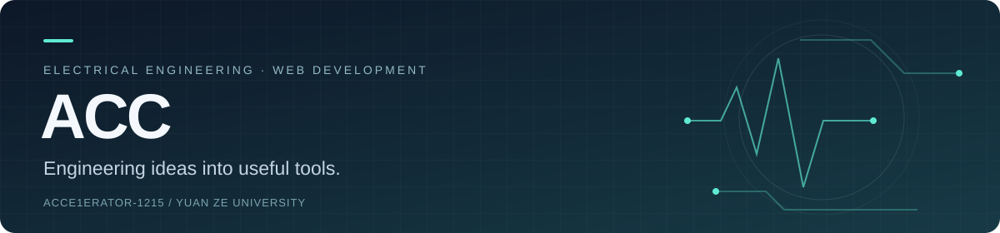

  

  <b>元智大學電機系學生 · Electrical Engineering @ Yuan Ze University</b> 
  把生活中的需求，做成實際可用的工具。 
  Building practical tools from everyday needs.

  <a href="https://github.com/Acce1erator-1215/kyoto-trip-firebase-final">Featured project / 精選作品</a>
  &nbsp;·&nbsp;
  <a href="https://github.com/Acce1erator-1215?tab=repositories">Repositories / 所有專案</a>

---

### About / 關於我

Hi, I'm **ACC**. I'm an electrical engineering student at Yuan Ze University, building web applications and exploring interactive systems.

我是元智大學電機系學生，透過專案實作探索網頁應用與互動系統。這裡整理我的作品，以及從想法到實作的過程。

### Featured work / 精選作品

#### [Kyoto Journey · 京都旅遊規劃工具](https://github.com/Acce1erator-1215/kyoto-trip-firebase-final)

A travel companion that brings itineraries, sightseeing, food, expenses, shopping and flight information into one interface.

把**每日行程、景點、美食、記帳、購物與航班資訊**整合在同一個介面，以和風視覺與行動裝置操作為設計重點。

`React` `TypeScript` `Firebase` `Vite`

[Explore the code / 查看原始碼 →](https://github.com/Acce1erator-1215/kyoto-trip-firebase-final)

Related implementation / 相關版本

[kyoto-trip-firebase](https://github.com/Acce1erator-1215/kyoto-trip-firebase) — another implementation of the Kyoto travel app, with the main application state and tab logic kept in the root `App.tsx`.

京都旅遊工具的另一個實作版本，主要狀態與分頁邏輯集中在根目錄的 `App.tsx`；精選版本則拆分為 Context、Hooks 與分頁元件。

### Current focus / 目前投入

**AegisNova** — building a GPU-accelerated dynamic topology simulation engine with Next.js, Docker and WebGL shaders.

探索 GPU 加速的動態拓樸模擬，以及網頁上的互動視覺化。

### Toolbox / 專案使用技術

| Area / 領域 | Technologies / 技術 |
| :--- | :--- |
| Web interfaces / 網頁介面 | React · TypeScript · HTML · Tailwind CSS |
| App tooling / 開發工具 | Vite · Git · GitHub |
| Application services / 應用服務 | Firebase |
| AegisNova focus / 研究方向 | Next.js · Docker · WebGL shaders |

---

Learn by building. Refine by doing. 在實作中學習，在迭代中進步。

